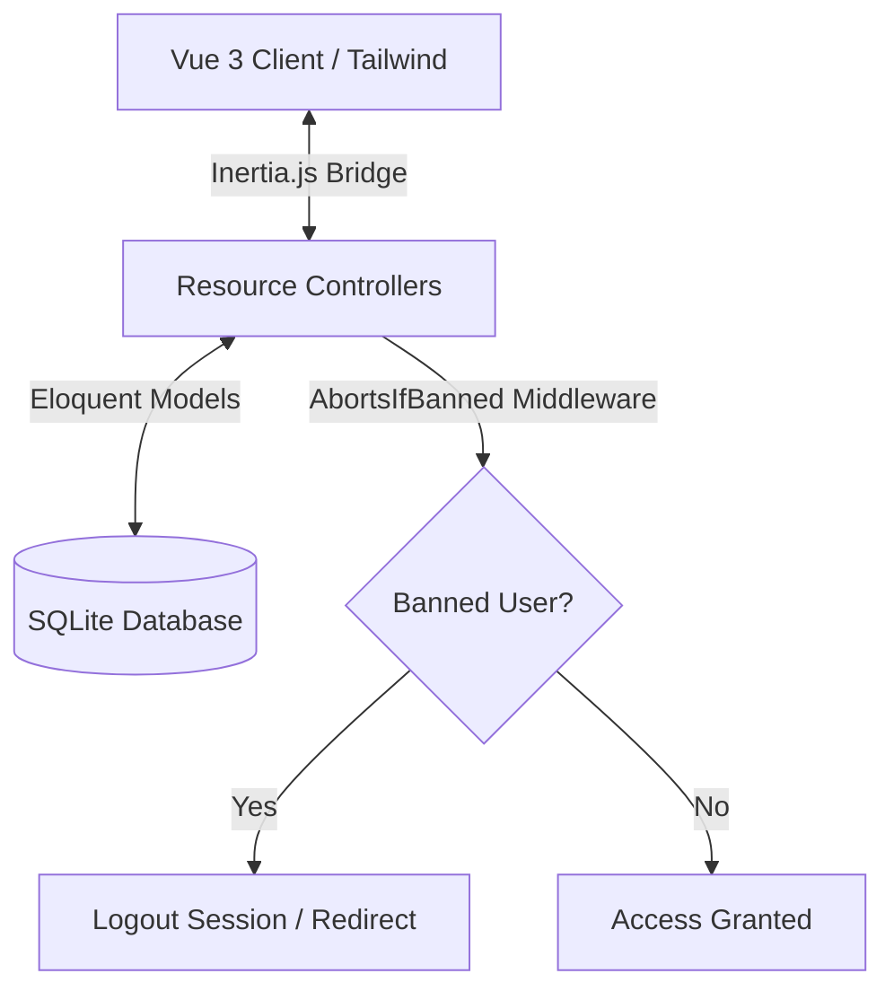

<div align="center">
  <br />
  
  # 📦 CashBox
  ### **Premium Multi-Account Financial Ledger, Loans & SaaS Billing OS**
  
  [](https://laravel.com)
  [](https://vuejs.org)
  [](https://tailwindcss.com)
  [](https://pestphp.com)
  
  <p align="center">
    A premium, high-contrast personal finance assistant, multi-account ledger, budget planner, and SaaS license manager.
    <br />
    Engineered with a streamlined monolithic stack for fast iteration, high security, and elegant usability.
  </p>
</div>

---

## 💎 Core Highlights & Features

### 📊 Multi-Account Transactions Ledger
- **Interactive Ledger**: Comprehensive search and multi-select filtering (by type, category, or account source) with dynamic top stats panels (Total Income, Total Expense, Net Flow) responding to filters in real time.
- **Date-based Constraints**: Constrained to default search boundaries for the *current calendar month* (automatically computed) with interactive start and end date pickers.
- **Pagination**: Fully integrated 15-item pagination on both frontend and backend for large transaction histories.
- **Transfer Modals**: Easy-to-use modals for registering Income, Expenses, and Double-Entry transfers between different accounts.

### 🏷️ Categorized Budgeting & Limit Alarms
- **Dynamic Category Limits**: Sets category-wise spending targets with warning progress bars that automatically change color (Green $\rightarrow$ Yellow warning $\rightarrow$ Red alert) as thresholds are reached.
- **Dedicated Categories Page**: Interactive cards showing item statistics for both income and expense categories, with responsive creation modals.
- **Seeded Accounts**: Automatically provisions a default **"Cash"** account (with initial balance `৳0.00`) and **10 pre-defined financial categories** for every new sign-up.

### 🧠 AI Budget Pacing Monitor
- **Real-Time Pacing Velocity**: Calculates daily spending velocities and pacing ratio comparing actual burn rate vs ideal budget allocations for current calendar month.
- **Visual Day Pacing Marker**: A custom vertical indicator line superimposed over each progress bar track showing where the current calendar day lies, making over-spending visually striking.
- **Gemini Copilot Integration**: Automatically passes current pacing states to the Gemini API (via local HTTP client) to receive a concise, tailored strategic allocation advice block recommending how to reallocate surplus funds from healthy categories to save failing envelopes.
- **High Performance Caching**: Caches Gemini API payloads for 6 hours per user to limit traffic and optimize response speed.

### 📅 Daily Summary & Diagnostics
- **Daily Budget Share**: Apportions the monthly budget limit into a daily share and calculates a carryover surplus/deficit from past days of the month.
- **Today's Summary Panel**: A dashboard widget displaying today's dynamic budget, actual spending, and cumulative savings.
- **Historic Daily Reports**: A dedicated daily reports interface with a date-picker to audit expense sheets and view itemized transaction histories for any day.

### 💰 Loans & Debt Statements
- **Loan Tracking**: Track money lent to clients or borrowed from institutions with dynamic outstanding balances.
- **Repayment Tracking**: Log repayments instantly to update active loan balances.

### 🔑 SaaS Licenses & Revenue Tracking
- **Automated Renewals**: Set billing cycles (monthly/yearly), next renewal dates, and status. Logging a payment automatically registers income and advances the renewal date.
- **Revenue Dashboard**: Displays Monthly Recurring Revenue (MRR) and Annual Recurring Revenue (ARR) calculations in real time.

### 🛡️ Superadmin Command Center
- **Granular Permissions Control**: Superadmins can enable or disable modules (Ledger, Budgets, SaaS, Loans, Recurring) for any user with real-time checkbox binds.
- **Permission-Driven Sidebar**: Navigation links in the left-sidebar automatically show/hide on the client-side based on user access.
- **Security Banning**: Toggle account bans instantly. Banned sessions are terminated on their next request via global middleware.
- **Self-Action Guardrails**: Logic blocks prevent superadmins from banning or deleting their own accounts.
- **Premium Service Orders**: Superadmin panel for managing customized service requests, including details like budget and project requirements.

### 🔔 FCM Push Notifications
- **Browser Subscriptions**: Push notification permission modal with background token registration.

### 📱 Android Companion App
- **Mobile Integration**: Downloadable companion Android APK (`Cash_Box_BD.apk`) directly from the homepage or user dashboard.
- **On-the-go Monitoring**: A native mobile app that tracks transaction categories, budgets, and ledgers in real time (under 6.5 MB, compatible with Android 8.0+).

---

## 🇧🇩 Currency, Design & SEO Optimizations

- **Bangladeshi Taka (৳)**: The entire application has been customized to use the Bangladeshi Taka symbol (`৳`) across all layout views, inputs, transaction ledgers, summaries, and forecasting tables.
- **Premium Safe Lock Logo**: Designed a colorful vector safe dial SVG logo using vibrant gradients (Indigo-to-Rose and Emerald-to-Blue) representing secure capital vaults.
- **High-contrast Favicon**: Included a dark-backed gradient SVG favicon that remains readable across light and dark browser themes.
- **SEO & OpenGraph Prep**: Pre-configured meta tags for Facebook OpenGraph and Twitter cards, paired with a custom marketing graphics banner (`og-image.png`).

---

## 📂 Project Directory Structure

```text
├── app/
│   ├── Http/
│   │   ├── Controllers/
│   │   │   ├── Auth/                     # Authentication controllers (Login, Registration, etc.)
│   │   │   ├── AccountController.php     # Manages user financial accounts
│   │   │   ├── BudgetController.php      # Manages monthly category budget allocations & AI monitor
│   │   │   ├── CategoryController.php    # Manages transaction categories
│   │   │   ├── DashboardController.php   # Coordinates core personal ledger statistics & daily summary snapshots
│   │   │   ├── LicenseController.php     # Controls SaaS client licenses & payment logs
│   │   │   ├── PremiumServiceOrderController.php # Manages service requests (Superadmin)
│   │   │   ├── RecurringScheduleController.php   # Handles recurring payments & logs
│   │   │   ├── ReportController.php      # Compiles financial reports, forecast predictions & daily summaries
│   │   │   └── SuperadminController.php  # Handles permissions toggles, bans, and deletions
│   │   └── Middleware/
│   │       ├── AbortsIfBanned.php        # Logs out and blocks banned accounts
│   │       ├── CheckModulePermission.php # Gates disabled pages based on permissions
│   │       ├── EnsureUserIsSuperadmin.php # Restricts endpoints to superadmins
│   │       └── HandleInertiaRequests.php # Shares auth and flash session states
│   ├── Models/
│   │   ├── Account.php                   # Account model (Cash, Bank, Mobile Wallet)
│   │   ├── Budget.php                    # Spending target budgets model
│   │   ├── Category.php                  # Transaction categories model
│   │   ├── Client.php                    # SaaS client profile model
│   │   ├── License.php                   # SaaS active contract/license model
│   │   ├── PremiumServiceOrder.php       # Lead generation requests model
│   │   ├── RecurringSchedule.php         # Recurring expenses/incomes scheduler model
│   │   ├── Transaction.php               # Ledger transactions entries model
│   │   └── User.php                      # Base authenticatable user model
│   └── Services/
│       └── BudgetMonitorService.php      # [NEW] Handles budget pacing math & Gemini API
├── bootstrap/
│   └── app.php                           # Global middleware and configuration registry
├── database/
│   ├── factories/                        # Model factories for automated testing
│   ├── migrations/                       # SQL table creation migrations files
│   └── seeders/                          # Database default entries seeders
├── public/
│   ├── favicon.svg                       # Customized high-fidelity vector favicon
│   ├── og-image.png                      # OpenGraph social sharing preview image
│   └── Cash_Box_BD.apk                   # [NEW] Compiled Android Companion App
├── resources/
│   ├── css/
│   │   └── app.css                       # Modernized Tailwind styles stylesheet
│   └── js/
│       ├── Components/                   # Reusable Vue components (Modals, Icons, etc.)
│       ├── Layouts/
│       │   ├── AuthenticatedLayout.vue   # Left-sidebar admin panel wrapper with footer
│       │   └── GuestLayout.vue           # Login / register screen template
│       └── Pages/
│           ├── Auth/                     # Authentication pages (Login, Register, etc.)
│           ├── Dashboard.vue             # User dashboard with today's summary panel & transactions
│           ├── Finance/
│           │   └── GlobalBudget.vue      # [NEW] AI budget pacing monitor pacing page with day-line marker
│           ├── Forecast/                 # Financial projection charts views
│           ├── Licenses/                 # Client listings & SaaS MRR/ARR manager
│           ├── Loans/                    # Debt ledger & repayment tracking
│           ├── PremiumServiceOrders/     # [NEW] Superadmin premium service request listings
│           ├── Recurring/                # Scheduled transactions dashboard
│           ├── Reports/                  # Historic trend lines & breakdown page
│           │   └── Daily.vue             # [NEW] Daily Budget vs Actual analysis report
│           └── Superadmin/
│               └── Dashboard.vue         # Command center tabs (Users, Permissions, Orders)
└── routes/
    └── web.php                           # Web endpoints and middlewared route groups
```

---

## 🛠Stack Architecture



---

## 🚀 Setup & Local Execution

### Prerequisites
- **PHP** (8.2 or higher)
- **Composer**
- **Node.js** & **npm**

### 1. Install Code Packages
```bash
# Install PHP dependencies
composer install

# Install JS dependencies
npm install
```

### 2. Environment Configurations
Clone the local environment template:
```bash
cp .env.example .env
```
*(Optional)* Add your Firebase credentials in `.env` to test Push Notifications:
```env
FIREBASE_API_KEY=your_api_key
FIREBASE_AUTH_DOMAIN=your_auth_domain
FIREBASE_PROJECT_ID=your_project_id
...
```
Add Gemini API credentials to enable the AI budget monitor feature:
```env
GEMINI_API_KEY=your_gemini_api_key
GEMINI_MODEL=gemini-1.5-pro
```

### 3. Migrate Schema
```bash
# Create SQLite DB file
touch database/database.sqlite

# Run database migrations
php artisan migrate
```

### 4. Boot Dev Servers
```bash
# Boot asset compiler (Terminal 1)
npm run dev

# Boot local server (Terminal 2)
php artisan serve
```
Open [http://127.0.0.1:8000](http://127.0.0.1:8000) in your web browser.

---

## 🧪 Comprehensive Quality Assurance

We maintain **98 feature test cases** validating authentication limits, category controls, SaaS logs, budget pacing analyzers, and superadmin middleware gates.

```bash
php artisan test
```

### Test Metrics
```text
Tests:  98 passed (385 assertions)
Time:   2.55s
```

---

## 📂 Codebase Navigation

*   **Database Schema**: [database/migrations/](file:///Users/morshedhabib/Sites/budget_management/database/migrations/)
*   **Eloquent Models**: [app/Models/](file:///Users/morshedhabib/Sites/budget_management/app/Models/) (User, Account, Category, Budget, Transaction, Client, License, PremiumServiceOrder)
*   **Controllers**: [app/Http/Controllers/](file:///Users/morshedhabib/Sites/budget_management/app/Http/Controllers/)
*   **Middlewares**: [app/Http/Middleware/](file:///Users/morshedhabib/Sites/budget_management/app/Http/Middleware/) (HandleInertiaRequests, AbortsIfBanned, CheckModulePermission, EnsureUserIsSuperadmin)
*   **Vue Components & Pages**: [resources/js/](file:///Users/morshedhabib/Sites/budget_management/resources/js/)
*   **Route Setup**: [routes/web.php](file:///Users/morshedhabib/Sites/budget_management/routes/web.php)
*   **Test Suite**: [tests/Feature/](file:///Users/morshedhabib/Sites/budget_management/tests/Feature/)

---

## 📄 License & Credits

Distributed under the MIT license. Developed with pride by **PRANTIK-SOFT** (Mobile: +8801735254295, Email: mhsohel017@gmail.com).
